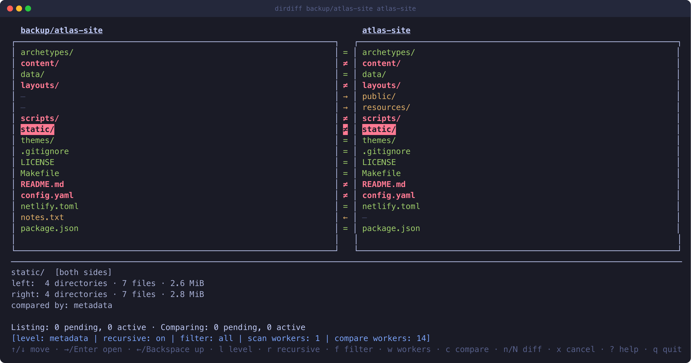

# dirdiff

A fast, read-only, interactive terminal UI for comparing two directory
trees side by side.

`dirdiff` never deletes, copies, moves, or writes anything on either side
— it's purely for exploring differences. It shows the first level of both
directories immediately, then scans deeper directories breadth-first in
the background without blocking the UI. Navigating into a directory
reprioritizes the background scan toward what you're looking at.
Comparing file contents is opt-in and explicit — you choose how thorough
a comparison to run (metadata, i.e. size + mtime, or a full byte-for-byte
content comparison), and where (just the current directory, or
recursively).



See [SPEC.md](SPEC.md) for the full design and rationale.

## Requirements

- Go 1.27 or newer (see `go.mod`)
- macOS or Linux (not tested on Windows)

## Installing a prebuilt binary

Tagged releases publish a `dirdiff_<os>_<arch>.tar.gz` archive for each
of linux/amd64, linux/arm64, darwin/amd64, and darwin/arm64 on the
[Releases page](https://github.com/m42cel/dirdiff/releases). Each
archive contains a single `dirdiff` binary:

```sh
tar -xzf dirdiff_linux_amd64.tar.gz
sudo mv dirdiff /usr/local/bin/
```

The `dev` release there is an unstable development build rebuilt on
every push to master — use a tagged `vX.Y.Z` release instead if you
want something stable to depend on.

## Building

From the repository root:

```sh
go build -o dirdiff ./cmd/dirdiff
```

This produces a `dirdiff` binary in the current directory. You can also
run it directly without a separate build step:

```sh
go run ./cmd/dirdiff <left-dir> <right-dir>
```

## Usage

```sh
dirdiff [flags] <left-dir> <right-dir>
```

### Flags

| Flag | Description |
|---|---|
| `--level=<level>` | Auto-apply a comparison level (`metadata`, `content`, or `none`) to the whole tree recursively in the background as it's discovered, instead of comparing manually. Default: `metadata`. |
| `--scan-workers=<n>` | Size of the directory-listing worker pool (default: `2` — one per side, since a listing job reads one side's directory; beyond that, listing is cheap, low-CPU I/O that doesn't benefit from scaling with core count). |
| `--compare-workers=<n>` | Size of the comparison worker pool (default: number of CPUs). |
| `--version` | Print version, commit, and platform, then exit. Released binaries report their tag (`dirdiff v1.0.0 (b1946ac92492, go1.27.1, darwin/arm64)`); builds made from a source checkout report `dev` plus the commit they came from, and a `go install`ed binary reports the module version it was installed at. |

### Keybindings

| Key | Action |
|---|---|
| `↑` / `↓` | Move cursor |
| `PgUp` / `PgDn` | Move by page |
| `Home` / `End` | Jump to first / last entry |
| `→` / `Enter` | Open the directory under the cursor (both panes navigate together) |
| `←` / `Backspace` | Go up to the parent directory — at the root, up to both compared roots as a single row |
| `l` | Switch the compare level — metadata (size + mtime) ↔ content (byte-for-byte) — remembered until changed again |
| `r` | Toggle recursive mode on/off — remembered, default on |
| `f` | Open the row-status filter popup — multi-select Left-only / Right-only / Equal / Different, space to toggle, enter to confirm — remembered like `l`/`r` |
| `w` | Open the worker-count popup — resize the scan/compare pools live |
| `c` | Compare the selected row at the current level/recursive setting — a file on its own, a directory's entries (or its whole subtree, with `r` on) |
| `C` | Compare the current directory the same way, whatever the cursor is on and whatever the filter hides |
| `n` / `N` | Jump to the next / previous difference in the current directory |
| `x` | Cancel all pending (not yet started) comparisons |
| `?` | Toggle the help overlay |
| `q` / `Ctrl+C` | Quit |

A directory that exists on only one side is still navigable — the
missing side shows a static placeholder. Existence is shown as soon as a
directory is listed; metadata/content comparisons only run once you
trigger them with `c`.

### Directory totals

The details panel at the bottom describes the row under the cursor. For a
directory that's what its subtree holds, per side: how many directories,
files, and symlinks are beneath it at any depth, plus the total size of
those files. Both counts and size update live as the background scan and
comparisons progress, and each side is counted on its own, so an entry
present on only one side counts only there. A directory that only exists
on one side has nothing to total on the other, so that side's line reads
`<does not exist>` rather than an all-zero total.

Sizes are shown in base-2 units (KiB, MiB, GiB, …), and a single file's
size also names its exact byte count — the metadata level calls two files
different on an exact size mismatch, which rounded units can hide.

Size is never measured for its own sake: `dirdiff` issues no `stat()`
call a comparison level didn't ask for. What it does measure, it measures
per side — including entries that exist on one side only, which have
nothing to be compared against but are still worth knowing the size of —
so a total converges to the exact figure once the level you asked for has
swept the subtree. Symlinks never contribute a size (comparing one reads
its link target, not a file, which is why they're counted apart from
files). While anything under a directory is still unsized the total reads
as a lower bound with the sized count next to it (`≥1.4 MiB (12/40 files
sized)`); when nothing under it is sized — as stays the case under
`--level=none`, where nothing is ever measured — the size shows as `?`.

Pressing `←` at the root goes up one more level, where the only row is
the pair of compared directories themselves — select it to read the
totals for each tree as a whole. That level isn't a listing of the roots'
real parent directories: nothing else in them is shown, listed, or
compared. `Enter` on the row goes back down into the roots.

The row-status filter (`f`) hides everything in the current listing that
doesn't match one of the selected statuses, except that a directory
containing a match anywhere below it stays visible — dimmed — so you can
still navigate down to it. A directory with no match at all, direct or
nested, is hidden entirely. Selecting all four statuses (the default) is
the same as no filtering. Equal/Different only ever match a file or
symlink's own result directly — never a directory's own rolled-up
status — so a directory only shows under Equal/Different through a
matching descendant; Left-only/Right-only still match a directory
directly when it's genuinely one-sided.

The worker-count popup (`w`) lets you resize either pool while dirdiff is
running, on top of the `--scan-workers`/`--compare-workers` starting
values — useful for reacting to how a particular pair of devices actually
performs instead of guessing correctly up front. Select a row, press
`Enter`, type a number, and press `Enter` again to apply it; growing adds
workers immediately, shrinking lets the excess finish whatever they're
currently doing rather than interrupting it.

### Status glyphs

Every status pairs a distinct glyph with a distinct color, so it's
legible without relying on color:

| Glyph | Meaning |
|---|---|
| `=` | Same (at the deepest level compared so far) |
| `≠` | Differs |
| `←` | Only exists on the left |
| `→` | Only exists on the right |
| `!` | Error (e.g. permission denied) |
| `⠋⠙⠹⠸⠼⠴⠦⠧⠇⠏` | Pending — a file's own comparison, or a directory rollup with a comparison still pending somewhere in its subtree, queued or in progress (animated Braille spinner) |
| `?` | Not yet compared |

Directories additionally roll up the worst status found anywhere in
their subtree, so you can spot which subtrees contain differences
without opening every one; the Braille spinner above takes priority
over a rollup result while work is still outstanding underneath, so a
subtree in progress is never mistaken for "clean so far". Listing
progress is shown separately, per side, next to a directory's name
(animated `.` / `..` / `...`) rather than in the shared glyph column.

## Development

```sh
go build ./...      # build everything
go vet ./...
gofmt -l .           # list files needing formatting
go test ./...         # run tests
go test ./... -race   # run tests with the race detector (recommended for
                       # internal/workqueue and internal/session, which
                       # are concurrency-sensitive)
```

See [CLAUDE.md](CLAUDE.md) for a tour of the package architecture.
